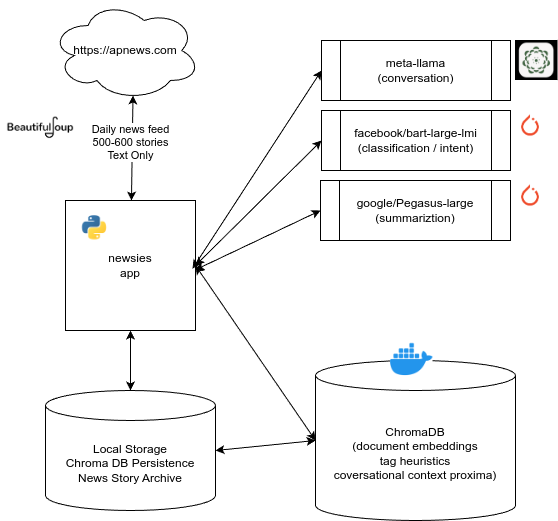
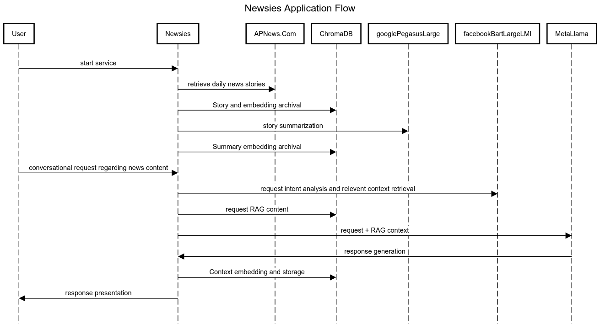

# Newsies

The Interactive News Explorer

This application provides a framework for conversational interaction with an AI-enhanced agent that makes finding the news most interesting to the user a hands-free experience.

It is anticipated that this will provide an API service for projects like Jarvus (<https://www.github.com/matthewapeters/gpt4all_agent>) which provides speech-to-text and text-to-speech services locally.

## Research Project

This is a personal research project using open-source and freely-available technologies.  It has been made available
for public viewing.  It may become open-source in the future.

## Tech Stack

 

 NOTE: Models are (c) their respective owners and may not be used commercially without appropriate licensing

## Application Flow

