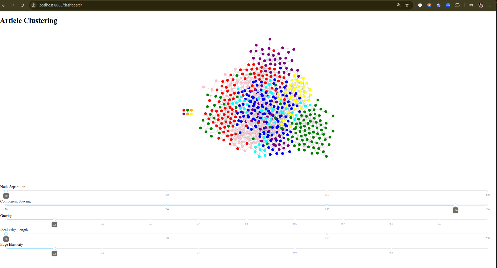

# Newsies

The Interactive News Explorer


This application provides a framework for conversational interaction with an AI-enhanced agent that makes finding the news most interesting to the user a hands-free experience.

It is anticipated that this will provide an API service for projects like Jarvus (<https://www.github.com/matthewapeters/gpt4all_agent>) which provides speech-to-text and text-to-speech services locally.

- [Newsies](#newsies)
  - [Research Project](#research-project)
  - [Application Flow](#application-flow)
  - [A Note on Run Tasks](#a-note-on-run-tasks)
  - [Command-Line](#command-line)
  - [Application Goals and Strategies](#application-goals-and-strategies)
    - [Goal](#goal)
    - [Strategies](#strategies)
      - [RAG](#rag)
      - [PEFT LoRA Adapter Model Fine Tuning](#peft-lora-adapter-model-fine-tuning)
  - [Article Clustering](#article-clustering)
    - [Technologies Used in Newsies](#technologies-used-in-newsies)

## Research Project

This is a personal research project using open-source and freely-available technologies.  It has been made available
for public viewing.  It may become open-source in the future.

 NOTE: Models are (c) their respective owners and may not be used commercially without appropriate licensing

## Application Flow


[I use sequencediagram.org to generate UML Sequence Diagrams](<https://sequencediagram.org/>)

NOTE: I am using FastAPI as its APIs are largely self-documenting.

## A Note on Run Tasks

Newsies uses a semaphore to ensure that only one task pipeline can run at a time.  Requesting multiple tasks while another task is running effectively queues the tasks.  While this solution is not fault-tolerant, the goal is to make it so - in the event of a cash, tasks should be resumable on service restart.  I am looking at using either Redis or a pickled state object towards this end.


## Command-Line

Services can be started and stopped from the command line, and pipelines can be initiated from the CLI as well.

All commands start with invoking `./scripts/newsies <command>`.

```bash
$ ./scripts/newsies 
+----------------------------------------+
|                                        |
|             .......                    |
|            .~~~~~~~~..                 |
|           .~.~~~~~.......              |
|           .~~~~... ..   .              |
|           .~~~...~:~~~.                |
|           .~. .~+:+:~~.                |
|              ..:::+~~.                 |
|           ~:::~::~:~~~~~~~..           |
|         .=o=+==+~:+++++=====+:.        |
|        .o==++=+~~=====+===+=+=+.       |
|       ~o===+++~.+====++==++++++++~     |
|      ~o===+:~~.:o===++::+~::=++++=:    |
|      =o==+~~~~+===+:+++~::..::+==+:    |
|     .=oo=+:::::::~~~::+.~~  .+==++~    |
|      :====+:=o+.......  . .~==++:.     |
|      :o===++o=+~ ..... .~:+=+:~+.      |
|     .=oo::=+=o+~ .... .:+++:.          |
|     +ooo==+++++~ .... ..::~            |
|    :oo==oo++:::~  ....                 |
|    =oo==o=++::++  ......               |
|    .=ooooo=+:+:=. ... ...              |
|      .~::+++++++  .... ...             |
|        ~........ .....  .              |
|        ........ ......                 |
|        ...... .  ...  . .              |
|         ~... .. ..........             |
|         ~.....  ..........             |
|         ........  ..... .              |
|           ..... . .~.....              |
|            .~...~   .....              |
|             ~~...    ....              |
|             ~~~..    .~...             |
|            .~:~~.    .:..~             |
|          .~:~~~..    .::~~.            |
|        .~:::~...     .::~:~.           |
|       .::~~~..       .::::~~.          |
|                       ....             |
+----------------------------------------+

Newsies Usage

Usage: newsies [routine]

CLI Commands
 get-news   download latest news from apnews.com
 analyze    schedule model training based on story page-ranking
 train  train model based on story page-ranking
 cli    initiate interactive agent session using most recently trained model
 up     tart backend services (ChromaDB, Redis)
 down   stop backend services
 chroma-stats   show backend service status
 chroma-logs    show backend service logs
--------------
API Server
 serve  start the FastAPI server
 kill   terminate the FastAPI server
 api    launch FastAPI session (shows interactive API docs)$ ./scripts/newsies 

```

## Application Goals and Strategies

### Goal

The goal of Newsies is to provide an AI agent that can converse about daily news.  Towards this end, I have taken a couple of approaches, with varying degress of success.

### Strategies

#### RAG

In this approach, the application attempts to understand what the user is asking about.  It tries to retrieve relevant documents and feeds them as context to an LLM, which generates a response using the retrieved documents.  This is extremely limited due to a couple of concerns:  

- LLMs can be quite limitted in the extend of context they can consume  
- Determining the user's actual intent is nearly 90% of the challenge.  By the time you can craft a query for the Prompt Engineering, the LLM is really just trying to summarize the retrieved content.

#### PEFT LoRA Adapter Model Fine Tuning

This is the current approach.  With this approach, there is little to no prompt engineering - the model has a layer fine-tuned on specific data, and can be prompted against that data.  There are still challenges.  

- Time: a recent test to fine-tune a LoRA Adapter with one day's worth of stories took 23 hours to complete.  It will be difficult and costly to come up with a solution that is cost-effective to maintain this level of fine-tuning daily
- Training and Testing Data: Training data must be generated for each story.  How much training data, and how the results are structured require some forethought.
  - I am currently relying on leveraging the Flan-T5 model to generate n questions about each story and n questions about each Named Entity that is found within the story.  Prompt engineering must be used to ensure that the questions cannot be answered without reading the article.  The article and its various sections and headlines (linked text to the article) must be provided as context to Flan-T5.
  - Training / Testing data must be tokenized to be consumed by the model in training.  This is also a time consuming exercise.
  - Training / Testing data needs to be saved and retrievable, as it is expensive to regenerate.  I split the training data and test data 80:20, tokenize each, and store the tokenized and untokenized data as .parquet files.  The folder structure is tied to the date and hour of generation.
- Training should be addative and strategically selective.  In order to make the model useful, break the daily training effort into strategic batches.
  - Use a vector database (ChromaDB) to index the embeddings of stories, along with their tags and NERs
  - Employ a KNN clustering strategy to identify clusters of data.  Clusters shold not just be based on today's data, although the training data will.
  - Use the clusters to identify which stories' training data to use.  Schedule a training session for each cluster.  Training sessions are asynchronous.
- The application, at run-time, will use the most recently fine-tuned LoRA Adapter with the model, even if training is ongoing.  The bet is that most questions will be related to central stories.  Over time, less central stories will make it intod the model from the corpus.

## Article Clustering



`One day's worth of articles clustered by KNN`

the `/dashboard/` endpoint shows how the lastest collection of articles cluster when KNN is applied across all of the articles collected to-date.  The goal is to break the heavy-lift of fine-tuning across clustered batches.

### Technologies Used in Newsies

<table width="100%">
  <tr>
    <td>
      
    </td>
    <td>
      
    </td>
    <td>
      
    </td>
  </tr>

  <tr>
    <td>
      
    </td>
    <td>
      
    </td>
    <td>
      
    </td>
  </tr>

  <tr>
    <td>
      
    </td>
    <td>
      
    </td>
    <td>
      
    </td>
  </tr>

</table>
